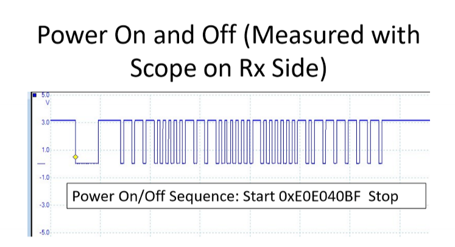
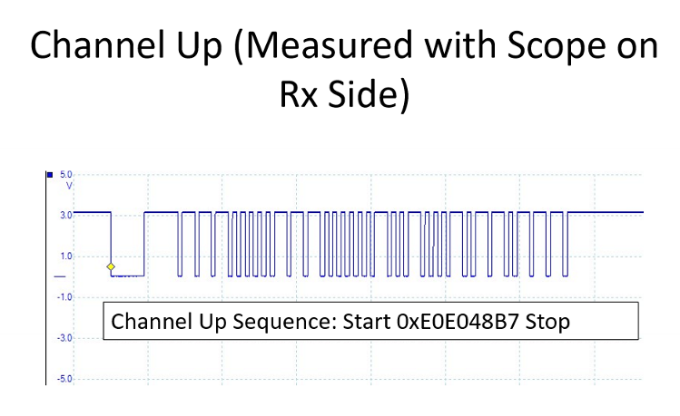
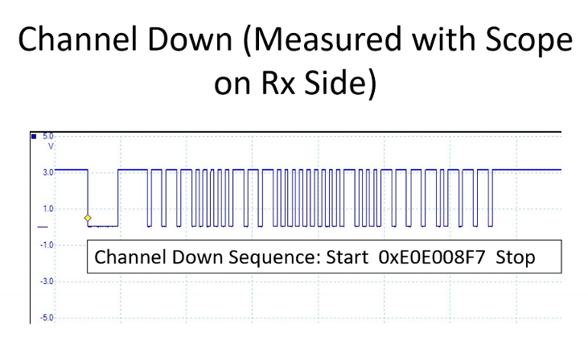
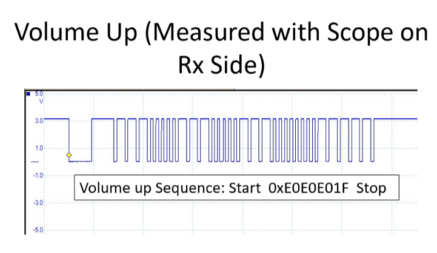
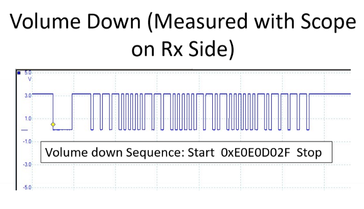

# App Project 1 Part B
This branch contains the source code that satisfies the requirements presented
for app project #1 part b concerning IR receiver.

# Overview
The aim of this assignment is to become familiar with receiving and decoding commands from a transmitter or a Samsung TV remote.

The video demonstration for this project is under this [link](https://www.youtube.com/watch?v=FRys7uWeAlk).

# Deliverables
Design an IR Receiver/Remote-Controller App using the 2nd microcontroller to decode commands transmitted by a Samsung TV remote. The infrared receiver should be connected on RB2/PIN6/CN6.

* Place the PIC code for the receiver app in source file IR.c
* The microcontroller remote control receiver should mimic a Samsung TV and display the following commands sent by the transmitter on the terminal window:
    * "TV ON/OFF" when **PB1** and **PB2** are pressed **together** for **3 seconds** on the IR transmitter.
    * "Channel Mode: Ch Up" or "Channel Mode: Ch Down" when in **channel** mode and **PB1** or **PB2** pressed on the transmitter.
    * "Vol Mode: Vol Up" or "Vol Mode: Vol Down" when in **volume** mode and **PB1** or **PB2** pressed on transmitter.
    * **Hex command value** for any other IR commands sent from a Samsung TV remote controller.

# Circuit Diagram


# Samsung TV Commands
* Power On/Off
```shell
 StartBit_0xE0E040BF
```

* Volume Up
```shell
StartBit_0xE0E0E01F
```

* Volume Down
```shell
StartBit_0xE0E0D02F
```

* Channel Up
```shell
StartBit_0xE0E048B7
```

* Channel Down
```shell
StartBit_0xE0E008F7
```

# Received Signals
The following shows what demodulated signals look like when received by the IR receiver.

* Power On/Off



* Channel Up



* Channel Down



* Volume Up



* Volume Down

