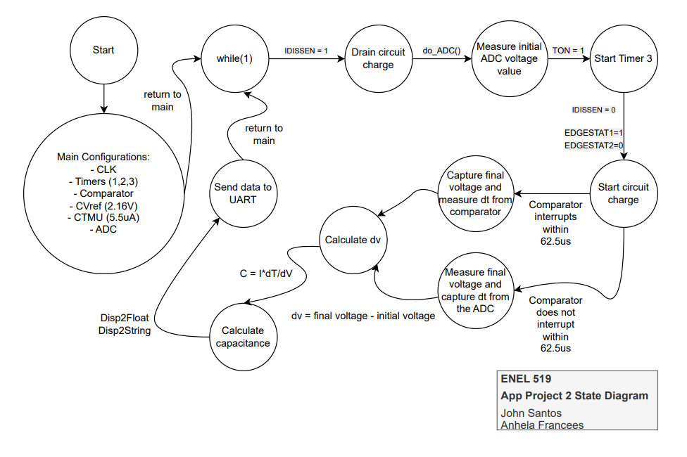

# App Project 2
This branch contains the source code that satisfies the requirements presented
for app project #2 concerning capacitance measurements.

# Deliverables
* Implement a capacitance measuring app on pin 16/AN11/RB13 using the CTMU on the PIC. Name source files ZSense.C and ZSense.h
    - App should be capable of measuring the capacitance of between 10pF and 1mF.
    - App should display the value of the capacitance on a single line of PC terminal window including units (in pF, nF, uF).
    - App should display the value of the capacitance vs. time over a minute on a Python Graph including units (in pF, nF, uF).
    - Verify the working of your code by measuring the capacitance between 10pF and 1mF.

# CTMU Mathematical Estimates
* pF - nF Caps: 1uA
* uF Caps: 10s of uA
* mF Caps: 10s of uA
* Capacitance values vs Rise Time to 2.5V?
* Smallest Capacitance measured?
    - Constraints: Timer
* Largest Capacitance measured?
    - Constraints: Timer and leakage current.

# State Diagram

# Challenges
This application project is not fully functional across all capacitance values.
Some challenges encountered are as follows:

1) Comparator needs a high voltage ~3.17V at the start of the program.
2) ADV voltage reading across the capacitor decreases most of the time as CTMU current charges the circuit.
3) Specific timing and specific CTMU current values are required for specific capacitances. This is
difficult to be handled using ADC alone, whereas if the comparator was functional, then it can be handled
by waiting for the comparator to interrupt and measure the timing to get dt whilst keeping current constant and dv is
known because final voltage value is CVRef for which the comparator basis its interrupt.

Consider the following values observed for specific current, timing, and capacitances.
* Capacitance, Current, Timing, PR3

  1uF,         55uA,    1.75ms, 7000

  0.1uF,       5.5uA,   62.5us, 250
  
  1nF,         5.5uA,   1.25us, 5