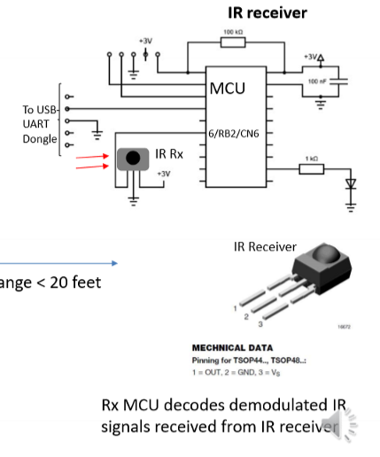

# App Project 1 Part A
This branch contains the source code that satisfies the requirements presented
for app project #1 part a concerning IR transmitter.

# Overview
The aim of this assignment is to become familiar with commanding and controlling a
Samsung TV Wireless Infrared (IR) Remote-Control protocol.

The video demonstration for this project is under this [link](https://www.youtube.com/watch?v=kvhVZCYP1tQ).

# Deliverables
Using the PIC 24F, you will design an IR Transmitter/Remote-Control app to control a
Samsung TV by wirelessly sending infrared commands to IR LED connected on PIN13/RB9.

* Place the PIC code for the transmitter app in source file ***TVIR.c*.
* The PIC24F remote control transmitter code should perform the following functions:
    * When PB1 and PB2 pressed together for 3 seconds or more: Microcontroller transmits power on/off IR command through the IR LED, and display "Power ON/OFF" on PC terminal.
    * When PB1 and PB2 pressed together for less than 3 seconds: Toggle between channel and volume modes.
    * In Channel mode:
        * When PB1 is pressed = Microcontroller transmits channel up command through 
        IR LED and display "Channel Up" on PC terminal.
        * When PB2 is pressed = Microcontroller transmits channel down command through
        the IR LED and display "Channel Down" on PC terminal.
    * In Volume mode:
        * When PB1 is pressed = Microcontroller transmits volume up command through 
        IR LED and display "Volume Up" on PC terminal.
        * When PB2 is pressed = Microcontroller transmits volume down command through
        IR LED and display "Volume Down" on PC terminal. 

# Circuit Diagram



# Modulation Types

In this assignment, OOK modulation will be used.


The carrier sine wave should be produced with a 38kHz signal. 

# Samsung TV Commands
* Power On/Off
```shell
 StartBit_0xE0E040BF
```

* Volume Up
```shell
StartBit_0xE0E0E01F
```

* Volume Down
```shell
StartBit_0xE0E0D02F
```

* Channel Up
```shell
StartBit_0xE0E048B7
```

* Channel Down
```shell
StartBit_0xE0E008F7
```

# Individual Bits
* Start Bit


* One Bit


* Zero Bit


